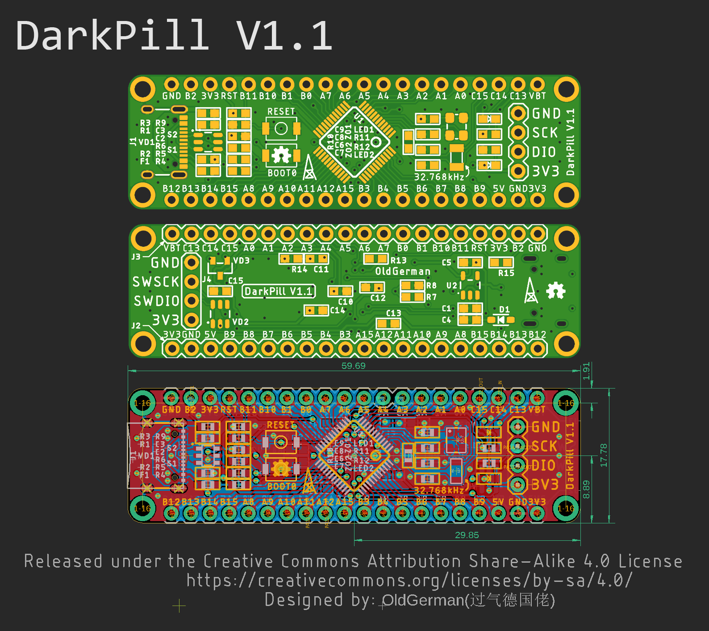
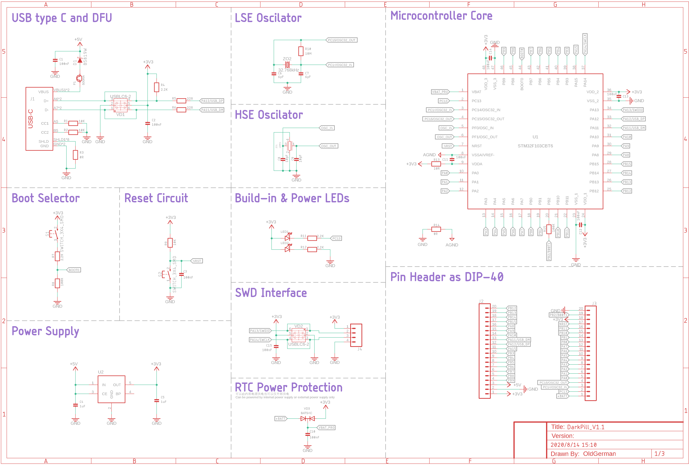
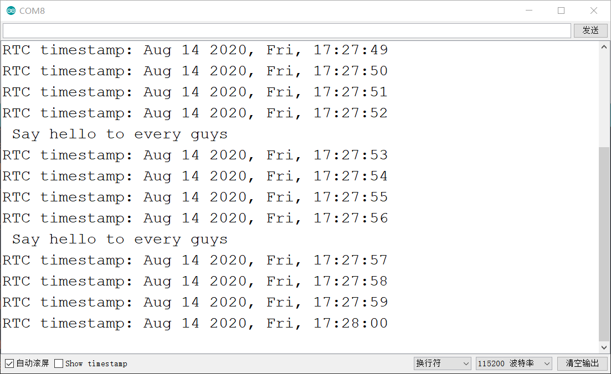

# DarkPill

A STM32 development board Improved from [BluePill](https://stm32-base.org/boards/STM32F103C8T6-Blue-Pill)

The first test board（DarkPill V1.0）welded by hand and it works great!

.png)

## Features

- Support LQFP48 packages such as STM32F030, F072，F103，F303，G474...
- Pin to pin with BluePill development kits(Except B2).
- Double-sided PCB layout, the board thickness is 1.0mm, size 59.7mm x17.8mm, both pads and vias have teardrops...
- Center symmetrical design.
- Discrete components are packaged in 0603, which is easy to solder by hand.
- There are four M2 holes around the PCB that are easy to fix.
- USB C Connector  supports positive and negative insertion.
- Use the [USBLC6-2](https://www.st.com/en/protection-devices/usblc6-2.html) ic to ESD protection, Don't need to solder it  will not affect the serial port work.

## PCB

## SCH

## B.O.M

| Num  | Qty  | Value          | Device                   | Package        | Parts                                                        |
| ---- | ---- | -------------- | ------------------------ | -------------- | ------------------------------------------------------------ |
| 1    | 1    | STM32F103CBT6  | STM32F303CBT6            | TQFP48         | U1                                                           |
| 2    | 1    | ME6211C33M5G-N | 3.3V 500mA LDO           | SOT23-5        | U2                                                           |
| 3    | 2    | USBLC6-2       | USBLC6-2-SOT23-6         | SOT23-6        | VD1, VD2                                                     |
| 4    | 1    | BAT54C         | BAT54C                   | SOT23-R        | VD3                                                          |
| 5    | 1    | B5819W         | B5819W-SOD323            | SOD-323        | D1                                                           |
| 6    | 1    | 500mA          | FUSE                     | 0603           | F1                                                           |
| 7    | 2    | LED            | LED_0603_MICRO           | 0603_LED       | LED1, LED2                                 LED               |
| 8    | 2    | 0R             | RESISTOR0603             | 0603           | R3, R14                                                      |
| 9    | 1    | 10R            | RESISTOR0603             | 0603           | R13                                        Resistors         |
| 10   | 2    | 22R            | RESISTOR0603             | 0603           | R5, R6                                                       |
| 11   | 4    | 2.2K           | RESISTOR0603             | 0603           | R4, R7, R11, R12                                             |
| 12   | 3    | 10K            | RESISTOR0603             | 0603           | R1, R2, R9                                                   |
| 13   | 2    | 100K           | RESISTOR0603             | 0603           | R8, R15                                                      |
| 14   | 1    | 10M            | RESISTOR0603             | 0603           | R10                                                          |
| 15   | 2    | 6.8pF          | CAP_CERAMIC0603          | 0603           | C6, C7                                                       |
| 16   | 2    | 10pF           | CAP_CERAMIC0603          | 0603           | C8, C9                                                       |
| 17   | 9    | 100nF          | CAP_CERAMIC0603          | 0603           | C1, C2, C3, C10, C11, C12,   C13, C14, C15                   |
| 18   | 2    | 1uF            | CAP_CERAMIC0603          | 0603           | C4, C5                                                       |
| 19   | 1    | 8/12/16MHz     | 3225_CRYSTALL            | 3.2X2.5_KX-7   | ZO1                                                          |
| 20   | 1    | 32.768kHz      | KX-327-NHF      CRYSTALL | 3.2X1.5        | ZO2                                                          |
| 21   | 2    | SWITCH_3X4_SMD | SWITCH_3X4_SMD           | SWITCH_3X4_SMD | S1, S2                                                       |
| 22   | 1    |                | USB_C2-LAYER             | USB-C-16P      | J1                                       USB   Type C 16Pin Connector |
| 23   | 2    |                | CONN_20                  | 1X20           | J2, J3                                                       |
| 24   | 1    |                | CONN_04PTH               | 1X4            | J4                                                           |

## Notice

### EN

If the U1 chip is STM32F103 and Programming [STM32duino-bootloader](https://github.com/rogerclarkmelbourne/STM32duino-bootloader) with [Arduino_STM32](https://github.com/rogerclarkmelbourne/Arduino_STM32) for DFU upgrade, the frequency of 3225 crystal oscillator must be 8, 12 or 16MHz, because these frequencies can be divisible by the [USB clock of 48Mhz](https://www.sigidwiki.com/wiki/High_Speed_USB_Noise). In order to save a lot of trouble, it is best to use an 8MHz crystal oscillator, but the 3225 package may not be easy to reach, such as [KDS DSX321G](http://ftp.kds.info/products/DSX321G_en.pdf).

If you use 12 or 16MHz, you need to build an arm tool chain and use make to recompile STM32duino-bootloader. Fortunately, I have compiled 12MHz and 16MHz STM32duino-bootloader, you can use it directly. However, it is not enough to just burn it, you also need to change the PLL multiplier value in boards_setup.cpp in the ArduinoSTM32 folder. [See here for details](https://oldgerman.github.io/201e530f/).

### ZH

若U1芯片为STM32F103，并且烧录[STM32duino-bootloader](https://github.com/rogerclarkmelbourne/STM32duino-bootloader)配合[Arduino_STM32](https://github.com/rogerclarkmelbourne/Arduino_STM32)以进行DFU升级，那么3225晶振的频率必须为8、12或16MHz，因为这些频率可以被[USB时钟48Mhz](https://www.cnblogs.com/cherishui/p/4204280.html)整除。为了省去很多麻烦，最好使用8MHz的晶振，但是3225封装的可能不太好买到，例如[KDS DSX321G](http://ftp.kds.info/products/DSX321G_en.pdf)。

若使用12或16MHz，需要搭建arm工具链，使用make重新编译STM32duino-bootloader，幸运的是，我已经编译好了12MHz和16MHz的STM32duino-bootloader，你可以直接使用。但是，仅仅烧录它是不够的，还需要改动ArduinoSTM32文件夹里的boards_setup.cpp中的PLL倍频的值，[步骤详见此处](https://oldgerman.github.io/201e530f/)。

## Test(V1.0)

### Programming methods

#### 1. Serial

<table>
    <td width = 53%><image src = "image/Programming-Serial.png"></td>
    <td><image src = "image/Programming-Serial(2).png"></td>
</table>

#### 2. ST-LINK

<table>
    <td width = 53%><image src = "image/Programming-SWD.png"></td>
    <td><image src = "image/Programming-SWD(2).png"></td>
</table>

#### 3. DFU (with STM32duino-bootloader)

<table>
    <td width = 53%><image src = "image/Programming-DFU.png"></td>
    <td><image src = "image/Programming-DFU(2).png"></td>
</table>

#### Notice:

Both using Serial or ST-LINK programming in this mode will disable the STM32duino-bootloader DFU function, and the symptoms are: the LED of PC13 cannot flash after Reset is pressed.:flushed:

在此模式下使用串行或ST-LINK编程都将禁用STM32duino-bootloader DFU功能，其症状为：按下Reset后PC13的LED无法闪烁.:flushed:

### RTC

